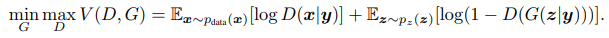
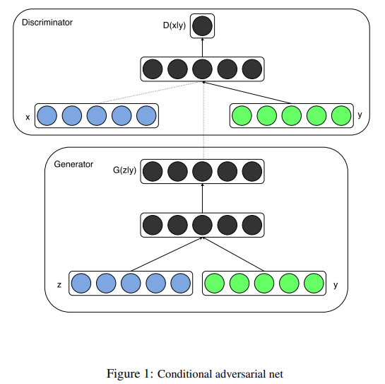
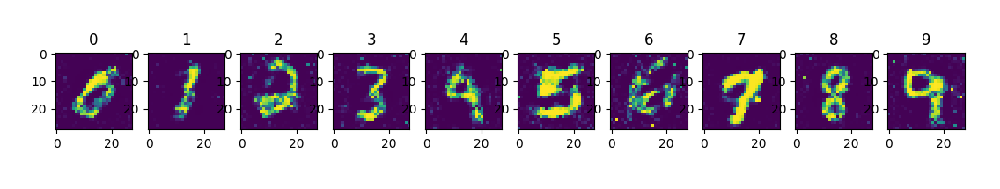

# Summary
Conditional generative adversarial nets (CGAN) is conditional version of gan. Using added input such as label, generator of GAN's probability P(X|Z) become P(X|Z,Y).
Y is the label of MNIST, and it induce generator generate specific fake image

# Loss function

  

# Model
## Network design
In this implementation, i refer the model suggested in the paper.  

  

## Network reference
1) y's dimension is 10 becasuse in this paper, it uses one hot vectors of label. MNIST image's number range is [0, 9] , so vector dimension is 10.

2) Latent vector z dimension 100 was drawn from a uniform distribution. Both z and y are mapped to hidden layers with Rectified Linear Unit
(ReLu) activation, with layer sizes 200 and 1000 respectively, before both being mapped to second, combined hidden ReLu layer of dimensionality 1200. We then have a final sigmoid unit layer as our output for generating the 784-dimensional MNIST samples.

3) The discriminator maps x to a maxout layer with 240 units and 5 pieces, and y to a maxout layer
with 50 units and 5 pieces. Both of the hidden layers mapped to a joint maxout layer with 240 units
and 4 pieces before being fed to the sigmoid layer.
**But discriminator is not critical, so it can be replaced other one**

4) The model was trained using stochastic gradient decent with mini-batches of size 100 and initial learning rate of 0.1 which was exponentially decreased down to .000001 with decay factor of
1.00004. Also momentum was used with initial value of .5 which was increased up to 0.7. Dropout with probability of 0.5 was applied to both the generator and discriminator. And best estimate of log-likelihood on the validation set was used as stopping point.

# Results

  

# Problem

# Reference
