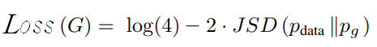

# Summary
"Generator" generate fake image and, Discriminator judge that image is real or fake. For training Discriminator, we should use real image for teaching what is real. 
JS divergence is used to loss function. Paper use that metric function for judging two probability distribution is close or not.  

Generator(P(Z|X)) can be close to Real data distribution which is not known, and we don't need to select specific probability distribution for matching. This is the main difference between VAE and GAN. VAE explicitly determine probability distribution, but GAN doesn't

**Note**: 'z' is sampled from N(0,1) or other things, not gurantee that Generator P(X|Z) is normal distribution.  
But VAE, we determine encoder's probability distribution for training such as normal distribution. But we don't need to determine decoder's probability distribution. I think there is the tendency that decoder's probability distribution follows encoder's probability distribution shape if their network layer is symmetric.

# Loss function 

# Result
 src folder's main.py is to load weight and make fake mnist image.  
 src folder's train.py is to train weight and save weight info to gen_weight_data.pt and, dis_weight_data.pt 
 
 
  

 I can get this result from main.py  
 
# Problem
 1) No need to generate various kind target image. For example, Uinsg MNIST to train, Generator could generate only '0' image, because it is enough to make discriminator confused. 
 2) Discriminator's training rate is more faster than Generator. Discriminator's dimension is lower than Generator because Discriminator only judge it is real and fake. So if D is optimal but G is not, there can be a problem of gradient vanishing.  
 
 **pf)** when discriminator is optimal loss function is defined like that
  
  

  
  Generator probability is function of theta, so Loss function can be seen like Loss = f(theta). JS diverence is depend on support(x-domian) so, if there is no intersected support between P_real and P_Generator JS valuse is infinite. In that area JS value is constant(but infinite), gradient is convergent to zero, so training doesn't go well. 
  **Note** : P_real and P_Generator are added noise, so they has not zero probability on all support, therefore meaningful support is judged if on that support it has a meaningful probability.  

# Reference
