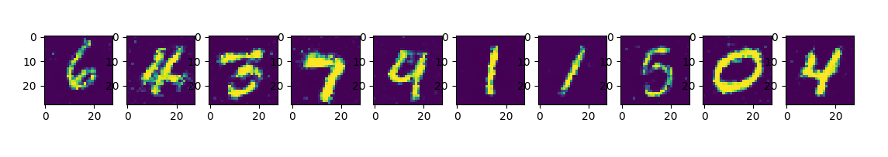

# Summary
"Generator" generate fake image and, Discriminator judge that image is real or fake. For training Discriminator, we should use real image for teaching what is real. 
JS divergence is used to loss function. Paper use that metric function for judging two probability distribution is close or not.  
Read Data distribution which is not known
<< 알려지지 않은 데이터 분포를, normal distribution으로 무작위 추출한 Z에 대해 P(z) - > data 가 되도록 P_g(Z)을 P data으로 만들게끔 학습시킴
<< 이점이 VAE와의 차이점인데, P(X|Z)을 normal으로 설정한 vAE와 다르게 GAN은 P_g(X|Z)을 normal 으로 설정하지 않고 내재적으로 결정된다.
주의할 점은 Z을 normal 에서 뽑아냈다 하더라도, P(X|Z)가 generator에선 normal 분포가 아니라는 것인데 << 그 이유는?

# Loss function 

# Result
 src folder's main.py is to load weight and make fake mnist image.  
 src folder's train.py is to train weight and save weight info to gen_weight_data.pt and, dis_weight_data.pt 
 
 
  

 I can get this result from main.py  
 
# Problem

# Reference
