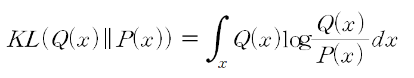
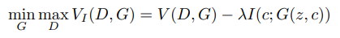
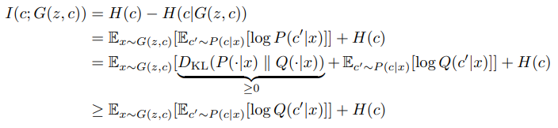
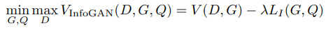
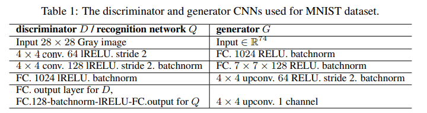
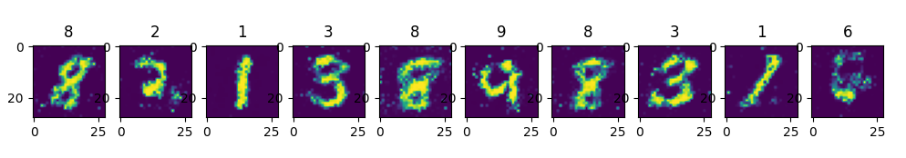

# Summary
In this paper, rather than using a single unstructured noise vector, we propose to decompose the input
noise vector into two parts: (i) z, which is treated as source of **incompressible noise;** (ii) c, which we
will call the latent code and will target the salient structured **semantic features of the data distribution**

For ease of notation, we will use latent codes c to denote the concatenation of all latent variables c_i.

**This paper's goal is to suggest the method of discovering these latent factors in an unsupervised way**

we provide the generator network with both the incompressible noise z and the latent code c, so the form of the
generator becomes G(z, c). If we use the standard form of GAN, the the generator is free to ignore the additional
latent code c by finding a solution satisfying P_G(x|c) = P_G(x). It means generator can generate fixed image.

To solve this problem, it suggests an information-theoretic regularization: there should be high mutual information
between **latent codes c and generator distribution G(z, c).** Thus I(c; G(z, c)) should be high. If mutual information is high, c is dependent on G(z,c). So we can know about G(z, c)'s information by using latent code c

# Informaton theory
## entropy

## conditional entropy

## joint entropy

## kl divergence
- It measures two distribution's shape and support is close or not .
- For example, P(x) and Q(x)'s shape and support is closer, kl-divergence's value is lower.
- It is calculated, 

  

- Note: KL(Q||P) is not equal to KL(P||Q). So it doesn't satisfy distance function's property.

## mutual information
- It means the method of measuring how much mutual dependency two random variables are. 
- If random variable x and y is independent, joint distribution p(x,y) is equal to p(x)p(y)
- Mutual information's formula is equal to KL(P(x,y) || P(X)P(Y))
- In this equation, we can infer that, P(X,Y) = P(X)P(Y), kl-divergence is 0, so X and Y are independent.
- We can measure how much dependent two random variable are, and how much they share mutual information, so we call it mutual information. 
- Mutual information : I(x,y) = KL(p(x,y)||p(x)p(y)) = H(x) - H(x|y) = H(y) - H(y|x)  

  
  

H(X) = X의 불확실한 정도. (=Y가 주어지지 않을 때 x의 불확실한 정도)  
H(X|Y) = Y가 주어졌을 때, X의 불확실한 정도.  
H(X) - H(X|Y) = Y로 인해 알아낸 X의 정보량.  

if) X and Y is independent, H(X) - H(X|Y) = H(X) - H(X) = 0, because, if you know Y but you don't infer any information of X by using known Y.
H(Y|X)'s value get lower accroding to how dependent X and Y are. So I(x;y)'s value get bigger because of I(x,y) is equal to H(y) - H(y|x).

# Loss function

  

In the loss functoin, mutual iunformation term is higher when training, so it makes c and G(z, c) dependent. And it means regularization term.

I(c; G(z, c)) is hard to maximize directly as it requires access to the posterior P(c|x). Fortunately we can obtain a lower bound of it by defining an auxiliary distribution Q(c|x) to approximate P(c|x):

  

The entropy of latent codes H(c) can be optimized over as well since for common distributions it has a simple analytical form.  However in this paper, they treat it as a constant.  

Lower bound is easy to approximate with Monte Carlo Simulation. But if we add this to GAN, does it change GAN's training procedure? Because, Lowerbound is directly calculated from Q which is gotten from G via reparametrization trick. It means generator in INFOGAN operate same to standart GAN. Just add new layer 'Q'

  

**minus Lower bound** is maximum when expected value is zero, so it is convergence to H(C), and it is the maximum value of lowerbound.

# Model
 In most experiments, Q and D share all convolutional layers and there is one final fully connected layer to output parameters for the conditional distribution Q(c|x), which means InfoGAN only adds a negligible computation cost to GAN.  
 For categorical latent code c_i, we use the natural choice of **softmax** nonlinearity to represent Q(ci|x).  
For continuous latent code c_j , there are more options depending on what is the true posterior P(cj |x).  

In our experiments, we have found that simply treating Q(c_j |x) as a **factored Gaussian** is sufficient.
Even though InfoGAN introduces an extra hyperparameter λ, it’s easy to tune and simply setting to 1 is sufficient for discrete latent codes. When the latent code contains continuous variables.

  

one categorical code, c1 ∼ Cat(K = 10, p = 0.1), which can model discontinuous variation in data, and
two continuous codes that can capture variations that are continuous in nature: c2, c3 ∼ Unif(−1, 1). Continuous codes c2, c3 capture continuous variations in style: c2 models rotation of digits and c3
controls the width.

We use leaky rectified linear units (lRELU) with leaky rate 0.1 as the nonlinearity applied to hidden layers of the discrminator networks, and normal rectified linear units (RELU) for the generator networks. Unless noted otherwise, learning rate is 2e-4 for D and 1e-3 for G; λ is set to 1.

# Results

  

# Reference
https://ratsgo.github.io/statistics/2017/09/22/information/  
https://hyunw.kim/blog/2017/10/14/Entropy.html  
Network model: https://github.com/eriklindernoren/PyTorch-GAN/blob/master/implementations/infogan/infogan.py  
paper: https://arxiv.org/pdf/1606.03657.pdf
