# Marginal distribution 
Joint probability distribution P(X, Z)'s marginal distribution is P(X) and P(Z)  

 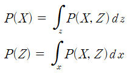 
 

# Conditional probability
Conditional probability P(X|Z) satisfies the following relationship.

 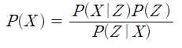 
 

we use that relationship for define VAE loss function.

# Derive loss function
1. There are two random variable. 1) X, 2) Z. 
2. X and Z has a relationship.  

 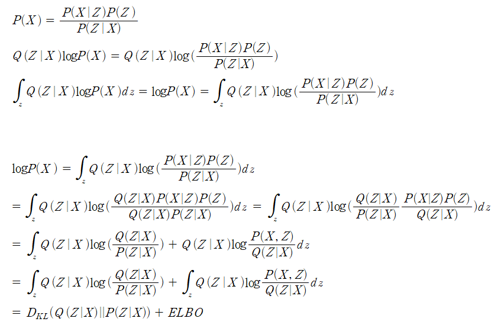 
 

# What is KL-divergence and ELBO?
KL divergence is defined like that

 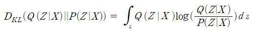 
 
It means metric function used to judge probability distribution Q and P is close. Lower KL-divergence value, closer they are. 

logP(X) is defined KL-divergece of Q(Z|X) and P(Z|X) plus ELBO term. logP(X) has limit, so higher ELBO value, lower KL-divergence. So ELBO term can become loss function.

 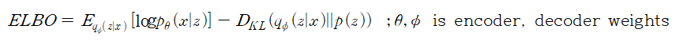 
 

 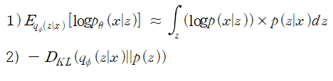 
 
if 1) has high value, it has high probability which decoder ouptut same image to encoder input. 1) is called "reconstruction error"
2) means "regularization"

loss function is like that

 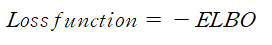 
 

# Calculate loss function gradient
using **Monte carlo gradient estimator** for caculating loss function gradient. For example 

 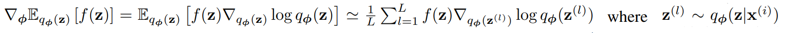 
 

And for making differentiable funciton, transform q(z|x).

 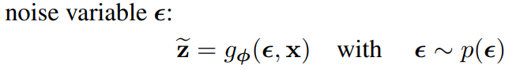 
 
Because, q(z|x) is not differentiable. To explain this detail, we use z that is sampled from q(z|x).
But there is no back propagation of randomly sampling because randomly sampling is not differentiable operation.  

For backpropagtion, paper use indirectly random sampling by using **epsilon ~ N(0,1)**. z is calculated as follows.

 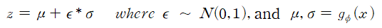 
 
By using this form, we can calculate the effect of mu and sigma to 'z'

So the main form of approximation to first term in loss function is like that

  
 

There is two version of approximation of loss function
1) First is to consider kl-divergence, and  
2) the other on is not to consider Kl-divergeonce only calculated **Monte Carlo estimate of the expectation**. Because KL-divergence in loss function can be integrated analytically, so only the expected reconstruction error requires estimation by sampling.

 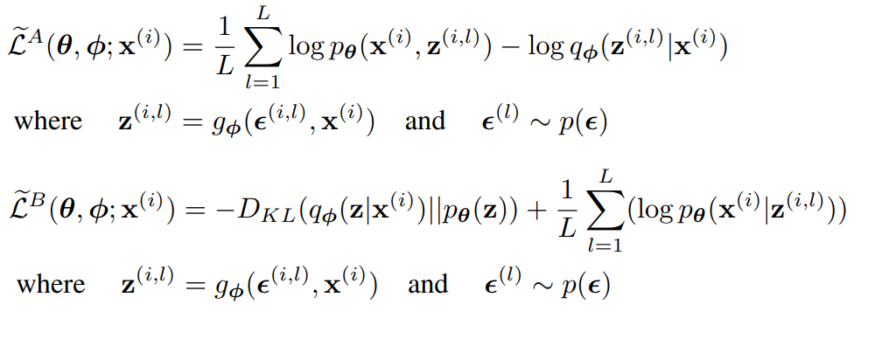 
 

Use minibatch, the loss function is finally calculated like that

 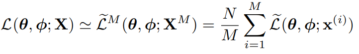 
 
X set size is N and, sampling 'M' datapoints for estimating loss function. 

Use calculated loss function and, calculated gradient. This is the all process for getting **monte carlo gradient estimation of loss function**

## Reparametrization trick
Becuase of transform q(z|x), lower bound estimation is defined like that, 

 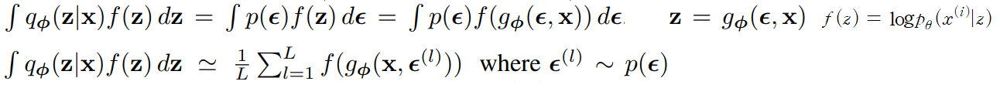 

z is sampled L times from one image x^(i)

If we use **gaussian distribution q(z|x) ~ N(mu, sigma^2)**
we can more easily calculate loss function

 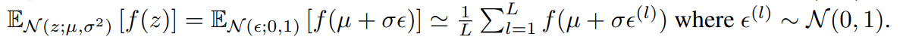 

## Appendix B: calculate kl-divergence when gaussian case
epsilon is N(0,1), so p(z) is N(0, 1). Therefore, 

 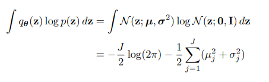 

And we choose arbitary probability distribution as gaussian distribution, so

 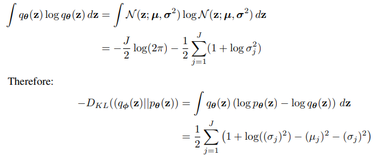 

# Implementation 
1) **kl-divergence** : paper explain how to calculate that term. J is the latent vector z's length. 
2) **reconstrunction error** : Using encoder's ouptut "mean, and sigma" for generating z. mean and sigma's size is [batch_size, z_dim]. Sampling N times for generate 'z', so generated 'z' size is [batchsize, sampling times, z_dimension]. 

In loss function regularization term, mu^2 and sigma^2 is minimized so, we can expect that term become zero. So After finish training, i use **torch.randn(batchsize, z_dimension)** to make z and create fake image
